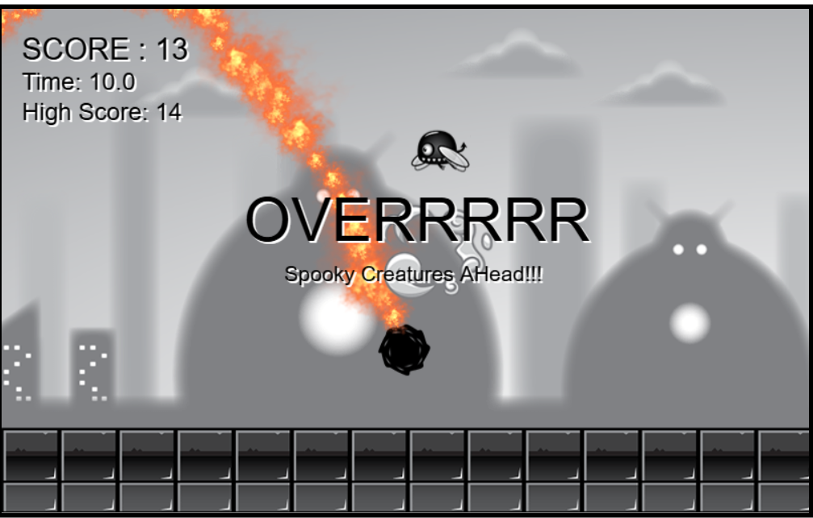

# JavaScript Side-Scroller Game

A 2D endless runner game built with vanilla JavaScript, HTML Canvas, and ES6 Modules. Dodge enemies, collect points, and try to beat your high score!



## ✨ Features

* **Advanced Player State Machine:** Player character uses a finite state machine (`Sitting`, `Running`, `Jumping`, `Falling`, `Rolling`, `Diving`, `Hit`) to manage animations and logic.
* **Attack & Collisions:** Defeat enemies by `Rolling` (`Enter`) or `Diving` into them to score points. Colliding in any other state will get you hit!
* **Dynamic Enemies:**
    * **FlyingEnemy:** Flies across the screen in a sine wave.
    * **GroundEnemy:** A stationary plant obstacle.
    * **ClimbingEnemy:** A spider that climbs up and down its web.
* **Parallax Background:** A seamless, multi-layered scrolling background creates a 2D depth effect.
* **Particle Effects:** Includes particle animations for `Dust` (while running), `Fire` (while attacking), and `Splash` effects.
* **Persistent High Score:** Your highest score is saved locally in your browser using `localStorage`.
* **UI & Score Tracking:** Displays current score, game timer, and your high score.
* **Game Over Screen:** A custom game over message appears based on your final score.
* **Debug Mode:** Press 'd' to toggle hitboxes and other debug information.

## 🎮 How to Play

* **ArrowLeft / ArrowRight:** Run left or right.
* **ArrowUp / Spacebar:** Jump.
* **ArrowDown:** Sit.
* **Enter:** Roll / Attack (you can defeat enemies in this state).
* **d:** Toggle Debug Mode.

## 💻 Tech Stack

* **JavaScript (ES6+):** All game logic is built with modern JavaScript, organized into ES6 modules.
* **HTML5 Canvas:** Renders all game graphics, animations, and UI.
* **CSS3:** (Presumed) For styling the main page and canvas.

## 🚀 How to Run Locally

Because this project uses ES6 modules (`import`/`export`), you cannot run it by just opening the `index.html` file directly from your filesystem (due to browser security policies). You must run it from a local server.

**The Easiest Way:**

1.  Make sure you have [Node.js](https://nodejs.org/) installed.
2.  2.  Open your terminal in the project's root directory.
3.  Install the `serve` package (if you don't have it):
    ```sh
    npm install -g serve
    ```
4.  Run the server:
    ```sh
    serve
    ```
5.  Open your browser and go to the URL it provides (usually `http://localhost:3000`).

**Python (Alternative):**

If you have Python 3 installed, you can run this command from the project's root directory:

```sh
python -m http.server
